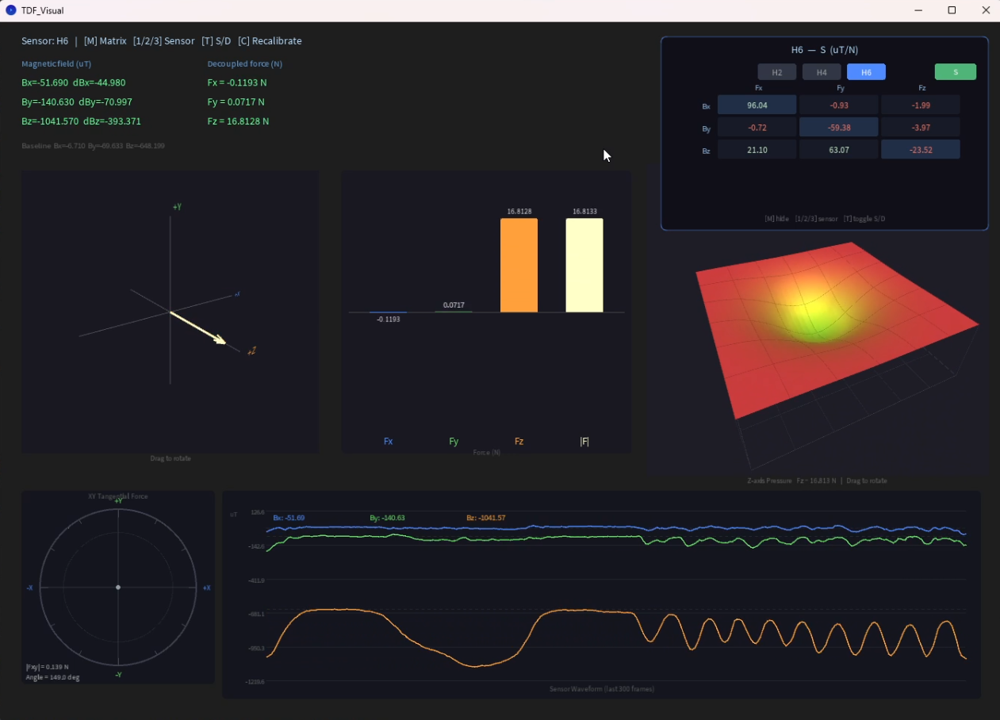
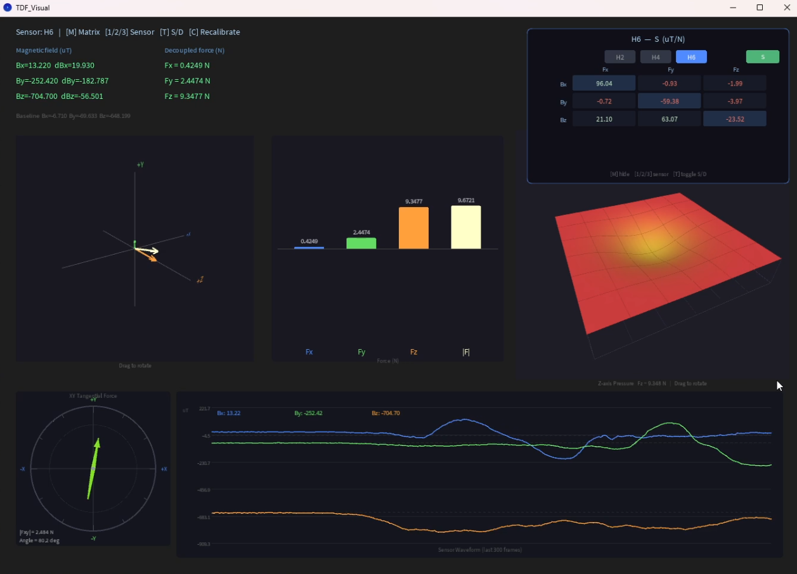

# TDF_Visual

`TDF_Visual` 是一个基于 Processing 的三维力传感器可视化项目，用来将磁场读数 `Bx / By / Bz` 解耦为 `Fx / Fy / Fz`，并以多种图形界面实时展示传感器状态。

## 演示效果

### Z 轴压力演示

这张图主要展示 `Fz` 压力曲面、Z 向受力柱状反馈，以及整体三维受力状态。



### 切向力演示

这张图主要展示 `XY` 切向力罗盘与切向受力方向变化，更适合观察横向拖拽或侧向受力效果。



## 项目简介

程序启动后会先进行基线校准，随后通过解耦矩阵将磁场变化量转换为三轴受力，并同步显示：

- 三维力矢量视图
- `Fx / Fy / Fz / |F|` 柱状图
- `Fz` 压力曲面
- `XY` 切向力罗盘
- `Bx / By / Bz` 实时波形
- `H2 / H4 / H6` 传感器矩阵查看面板

核心关系如下：

```text
ΔV = [Bx - baselineX, By - baselineY, Bz - baselineZ]
F  = D * ΔV
D  = S^-1
```

其中：

- `S` 为灵敏度矩阵，单位 `uT/N`
- `D` 为解耦矩阵，单位 `N/uT`

## 功能特性

- 支持 `H2`、`H4`、`H6` 三种传感器模型切换
- 启动后自动进行 `300` 帧基线采样
- 串口实时接收传感器 CSV 数据
- 根据 `Processed_Data.xlsx` 自动生成 `sensitivity_data.csv`
- 支持矩阵面板显示 `S / D` 两类矩阵
- 提供 3D 旋转交互查看力矢量和压力曲面

## 运行环境

- Processing `4.x`
- Windows 串口环境
- Python `3.x` 和 `openpyxl`（可选，仅在需要从 Excel 重新生成 CSV 时使用）

## 快速开始

1. 安装 Processing `4.x`。
2. 如需从 `Processed_Data.xlsx` 重新生成 `sensitivity_data.csv`，先安装 Python 依赖：

   ```bash
   pip install openpyxl
   ```

3. 使用 Processing IDE 打开项目目录并运行 `TDF_Visual.pde`。
4. 连接串口设备，程序默认以 `115200` 波特率读取数据，并优先匹配包含 `COM` 的串口名。
5. 启动后保持传感器静止，等待基线采样完成后进入实时显示。

如果你使用命令行，也可以运行：

```bash
processing-java --sketch=/path/to/TDF_Visual --run
```

## 数据输入格式

程序支持以下 CSV 数据格式：

```text
Bx,By,Bz
SensorID,Bx,By,Bz
Bx,By,Bz,Fx,Fy,Fz
```

说明：

- `Bx / By / Bz` 单位为 `uT`
- 当输入为 4 列时，首列 `SensorID` 会被忽略
- 当输入为 6 列时，后 3 列力数据当前不参与计算

## 快捷键

| 按键 | 功能 |
| --- | --- |
| `M` | 显示或隐藏矩阵面板 |
| `T` | 切换 `S / D` 矩阵显示 |
| `1 / 2 / 3` | 选择 `H2 / H4 / H6` |
| `C` | 重新执行基线校准 |

## 项目结构

| 文件 | 作用 |
| --- | --- |
| `TDF_Visual.pde` | 主入口，负责界面调度与交互 |
| `SensorReceiver.pde` | 串口接收与 CSV 解析 |
| `Baseline.pde` | 基线采样与校准进度显示 |
| `Decoupling.pde` | 灵敏度矩阵加载、矩阵求逆、力解耦计算 |
| `ForceView.pde` | 三维力矢量与柱状图 |
| `PressureGrid.pde` | `Fz` 压力曲面显示 |
| `TangentialCompass.pde` | `XY` 切向力罗盘 |
| `SensorPlot.pde` | `Bx / By / Bz` 实时波形 |
| `MatrixHUD.pde` | 传感器矩阵叠加面板 |
| `convert_data.py` | 从 Excel 提取灵敏度矩阵并生成 CSV |
| `Processed_Data.xlsx` | 原始灵敏度数据 |
| `sensitivity_data.csv` | 运行时读取的灵敏度矩阵文件 |

## 数据流

```text
Serial CSV
  -> SensorReceiver
  -> Baseline
  -> Decoupling
  -> Force / HUD Visualization
```
