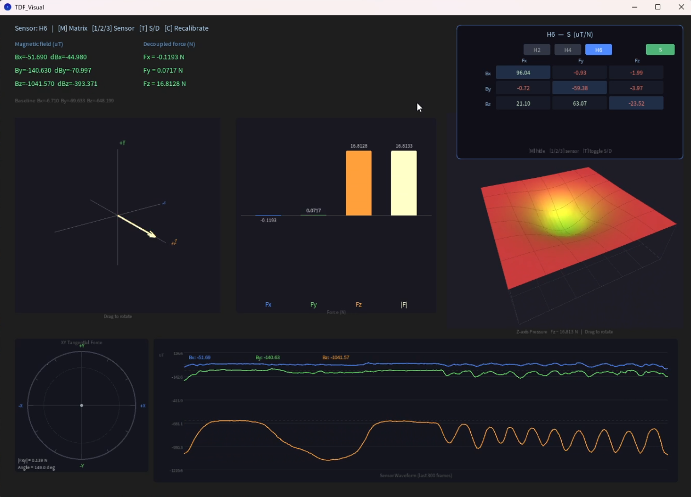
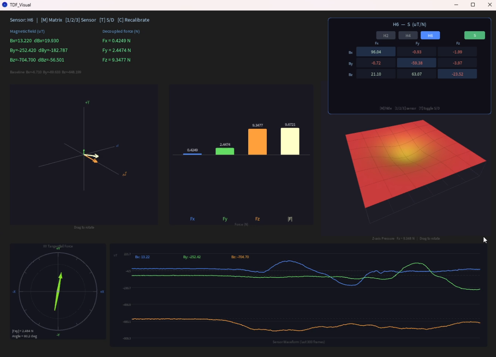

# TDF_Visual

`TDF_Visual` 是一个基于 [Processing](https://processing.org/) 的三维力传感器可视化项目：磁传感器（MLX90393）读取 PDMS 内嵌磁铁结构的磁场 `Bx / By / Bz`，程序将其实时解耦为三轴受力 `Fx / Fy / Fz`，并通过一整套仪表盘式面板（三维力矢量、压力垫、切向罗盘、波形、矩阵等）展示传感器状态。支持 **H2 / H4 / H6** 三种传感器模型，支持 **USB 串口** 与 **蓝牙 BLE（ESP32-C3）** 两种数据源，并内置 **CSV 数据录制** 功能。

本仓库同时包含配套的**标定数据管线**（`TDF_DataProcess/` 子目录：原始标定数据 + Python 分析脚本），可视化与数据处理统一在一个仓库、双分支（`main` 稳定 / `dev` 开发）管理。

## 演示效果

> 注：界面经过多轮重构，下面的截图展示整体思路，实际 UI（字体、面板布局、控件）与最新版本会有差异。

### Z 轴压力演示

主要展示 `Fz` 压力垫、Z 向受力反馈与整体三维受力状态。



### 切向力演示

主要展示 `XY` 切向力罗盘与切向受力方向变化，适合观察横向拖拽 / 侧向受力。



## 核心原理

程序启动后先选择数据源，再进行基线校准（采集 `100` 帧静止数据求平均），随后用解耦矩阵把磁场变化量转换为三轴受力：

```text
ΔV = [Bx - baselineX, By - baselineY, Bz - baselineZ]
F  = D * ΔV
D  = S^-1
```

- `S`：灵敏度矩阵，单位 `uT/N`（行 = Bx/By/Bz，列 = Fx/Fy/Fz），由 `TDF_DataProcess` 管线从标定数据拟合得到
- `D`：解耦矩阵，单位 `N/uT`，由 `S` 求逆得到
- **`Fz` 按"只测压"处理**：解耦后 Z 向负值会被钳为 0；`Fx / Fy` 保留正负

## 数据源（串口 / BLE 双通道）

启动后首先显示**数据源选择界面**（两张卡片，也可按 `S` / `B` 快捷键）：

| 数据源 | 链路 | 说明 |
|--------|------|------|
| **Serial (USB)** | `Single_Sensor.ino` → USB 串口（115200） | 有线方案，自动匹配含 `COM` 的端口 |
| **Bluetooth LE** | `BLE_Arduino.ino`（ESP32-C3）→ BLE NUS → `ble_bridge.py` → 标准输入流 | 无线方案，设备名 `TDF_Sensor`，100 Hz 采样；桥接脚本自动扫描、断线自动重连 |

两条链路输出**相同的 `x,y,z` 文本帧**，共用同一套解析逻辑。运行中可随时点顶部 `SOURCE` 按钮或按 `ESC` 返回选择界面**热切换**数据源（不必重启程序）。

## 界面面板

| 面板 | 内容与交互 |
|------|------------|
| **Sensor State**（顶部状态栏） | 基线、磁场增量、解耦力三列读数；传感器徽章、`LIVE/HOLD`（按数据流时效判定，断流 0.4s 才变 HOLD）、`BAD` 坏帧计数；右侧纵向控件列：**REC**（CSV 录制）、**SOURCE**（热切换数据源）、**FPS**（绿/黄/红分级）、**Calibration** |
| **S / D Matrix**（矩阵面板） | `H2 / H4 / H6` 选项卡、`S/D` 切换、3×3 矩阵数值；始终可见 |
| **3D Force Vector**（三维力矢量） | 立体笼 + 彩色坐标轴 + 原点球 + 地面网格；三根分量箭头 + 发光合力箭头 + 分量投影虚线；面板上**拖拽可自由旋转** |
| **Force Components**（柱状图） | `Fx / Fy / Fz / |F|` 四根柱，按各自轴的全局量程归一 |
| **Z-Axis Pressure**（压力垫） | 点阵随 `Fz` 由绿变红、按高斯隆起；默认正俯视，**拖拽自由旋转**，`Reset` 复位视角 |
| **XY Tangential Force**（切向罗盘） | 阻尼平滑的指针表示 XY 切向力（真实方向 + 大小），按合成 XY 量程归一 |
| **Magnetic Delta Waveform**（波形） | `dBx / dBy / dBz` 滚动波形；**默认显示 200 个点**，底部滑块可调显示点数（50~600），`Reset` 复位为 200 |
| **Axis Ranges**（全局量程） | `X / Y / Z` 三个量程滑块 + `XY Lock`（默认开）+ **`DENT` 滑块**（压力垫凹陷敏感度 0.2~5×，纯视觉效果，不影响任何计算数值）+ `Reset` |

> 3D 力矢量的轴向映射：屏幕**下方 = +Z**、**左下 = +X**、**右下 = +Y**。

## CSV 数据录制

- 顶部 **REC** 按钮开始录制（按钮变红、显示已录秒数），再按停止并**弹窗命名**文件；
- 数据写入 `csv_export/` 文件夹（自动创建），**按满采样率逐帧记录**（不受 60 FPS 画面刷新限制）；
- 列：`epoch_ms, t_ms, Bx/By/Bz(uT), dBx/dBy/dBz, Fx/Fy/Fz(N)`；
- 弹窗取消、切换数据源、程序退出均不丢数据（自动以时间戳名落盘）；上次异常退出的半成品会在下次录制时自动抢救为 `recovered_*.csv`。

## 交互操作

### 快捷键

| 按键 | 场景 | 功能 |
| --- | --- | --- |
| `S` / `B` | 选择界面 | 选择串口 / 蓝牙 |
| `ESC` | 运行中 | 返回数据源选择界面（不退出程序） |
| `T` | 运行中 | 切换 `S / D` 矩阵显示 |
| `1 / 2 / 3` | 运行中 | 选择 `H2 / H4 / H6` 传感器 |
| `C` | 运行中 | 重新执行基线校准 |

### 鼠标

- 顶部控件列：`REC` 录制、`SOURCE` 热切换数据源、`Calibration` 重新校准
- 矩阵面板：点选 `H2/H4/H6` 选项卡、`S/D` 切换
- 3D 力矢量 / 压力垫：拖拽旋转视角（压力垫有 `Reset`）
- 全局量程：拖动 `X/Y/Z/DENT` 滑块、`XY Lock` 开关、`Reset` 复位
- 波形：拖动点数滑块、`Reset` 复位点数

## 运行环境

- Processing `4.x`
- **串口模式**：Windows 串口环境（波特率 `115200`）
- **BLE 模式**：Python `3.x` + `bleak`（`pip install bleak`），以及烧录了 `BLE_Arduino.ino` 的 ESP32-C3
- Python `3.x` + `openpyxl`（**可选**，仅在需要从 Excel 重新生成 CSV 时使用）
- 字体 `Orbitron`、`Space Mono`（已随项目放在 `data/`，无需额外安装）

> **性能提示**：3D 面板较吃显卡。若是带独显的笔记本（混合显卡），请确保 Processing 的 `java.exe` 走**独立显卡**，否则默认走核显会明显掉帧。`ForceView.pde` / `PressureGrid.pde` 顶部的 `FV_SS` / `PG_SS`（超采样倍数）可在"清晰度"与"帧率"间权衡。

## 快速开始

1. 安装 Processing `4.x`。
2. 按需安装 Python 依赖：

   ```bash
   pip install bleak openpyxl
   ```

3. 用 Processing IDE 打开项目目录并运行 `TDF_Visual.pde`（所有 `.pde` 标签会一起编译，`TDF_DataProcess/` 子目录会被 Processing 忽略）。
4. 在启动界面选择数据源：
   - **串口**：连接 USB 设备（`Single_Sensor.ino`）；
   - **BLE**：给 ESP32-C3 上电（`BLE_Arduino.ino`），程序自动扫描 `TDF_Sensor` 并连接。
5. 保持传感器静止，等待基线采样（100 帧）完成后进入实时显示。

命令行方式：

```bash
processing-java --sketch=/path/to/TDF_Visual --run
```

## 数据输入格式

两条链路均输出以下 CSV 文本帧（`;` 会被自动转成 `,`）：

```text
Bx,By,Bz
SensorID,Bx,By,Bz
Bx,By,Bz,Fx,Fy,Fz
```

说明：

- `Bx / By / Bz` 单位为 `uT`
- 4 列时首列 `SensorID` 被忽略；6 列时后 3 列力数据当前不参与计算
- 以 `#` 开头、或含 `:` / `=` 的行视为调试/表头并跳过；非有限值会被丢弃并计入 `BAD` 计数
- BLE 固件在传感器读取失败时会发送哨兵值 `-1,-1,-1`，传感器缺失时发送 `0,0,0`

固件参考：`Single_Sensor/Single_Sensor.ino`（串口）与 `BLE_Arduino/BLE_Arduino.ino`（BLE，`DEBUG_MODE` 均保持为 `0`）。

## 灵敏度数据流程

**上游（`TDF_DataProcess/`，标定数据变化时手动运行）**：`python process_sensitivity.py` 读取 `Raw_Data/` 下 158 个原始标定 CSV（X/Y 轴 0–3N 各 7 级、Z 轴 0–20N 41 级），计算逐级均值、最小二乘拟合灵敏度（**带 R² / 残差质量报告与非线性警告**），生成拟合图并写入 `TDF_DataProcess/Processed_Data.xlsx`（保存前自动 `.bak` 备份）。

**下游（程序启动时）**：`Decoupling.pde` 先尝试运行 `convert_data.py`（读仓库根目录的 `Processed_Data.xlsx` → 写 `sensitivity_data.csv`），再读取 CSV 构建 `S` 并求逆得到 `D`。若没有 Python，则直接用已有的 CSV。

> 注意：`Processed_Data.xlsx` 目前存在两份（仓库根目录一份供程序读取、`TDF_DataProcess/` 一份由管线生成），标定值更新后需手动同步。

## 项目结构

| 文件 | 作用 |
| --- | --- |
| `TDF_Visual.pde` | 主入口：`setup/draw`、输入处理、顶部状态栏与控件列、设计空间缩放 |
| `Connection.pde` | 数据源状态机：启动选择界面、BLE 桥接进程管理、热切换 |
| `SensorReceiver.pde` | 帧解析（串口/BLE 共用）、坏帧统计、LIVE/HOLD 时效判定 |
| `CsvExport.pde` | CSV 录制：REC/STOP、满采样率写盘、异步命名弹窗、崩溃抢救 |
| `Baseline.pde` | 基线采样（100 帧）与校准进度 |
| `Decoupling.pde` | 灵敏度矩阵加载、求逆、力解耦（`Fz` 钳为非负） |
| `ForceView.pde` | 三维力矢量仪表 + 柱状图（离屏 P3D） |
| `PressureGrid.pde` | `Fz` 压力点阵（离屏 P3D，可旋转，凹陷受 `DENT` 调节） |
| `TangentialCompass.pde` | `XY` 切向力罗盘（阻尼指针） |
| `SensorPlot.pde` | `dBx / dBy / dBz` 实时波形 + 点数控制 |
| `RangePanel.pde` | 全局 `X/Y/Z` 量程滑块 + XY 锁 + `DENT` 滑块 + 复位 |
| `MatrixHUD.pde` | `S / D` 矩阵叠加面板 |
| `Theme.pde` | 配色、字体、面板/徽章绘制工具 |
| `ble_bridge.py` | BLE → stdout 桥接（bleak，自动扫描/重连） |
| `convert_data.py` | 从 Excel 提取灵敏度矩阵生成 CSV |
| `Processed_Data.xlsx` / `sensitivity_data.csv` | 灵敏度数据（xlsx 为源、csv 为运行时读取） |
| `Single_Sensor/` | 串口固件（Arduino + MLX90393） |
| `BLE_Arduino/` | BLE 固件（ESP32-C3 + MLX90393，NUS，100 Hz） |
| `TDF_DataProcess/` | 标定数据管线：`Raw_Data/` 原始数据、`process_sensitivity.py` 分析脚本、拟合图、`AI_Calibration_Plan.pdf`（机器学习标定实验方案） |
| `data/*.ttf` | Orbitron / Space Mono 字体 |

## 数据流

```text
TDF_DataProcess: Raw_Data CSV --process_sensitivity.py--> Processed_Data.xlsx
                                        (手动同步到根目录副本)
根目录: Processed_Data.xlsx --convert_data.py--> sensitivity_data.csv ─┐ (启动一次)
                                                                      ▼
串口: Single_Sensor.ino ──USB──► serialEvent ─┐
BLE:  BLE_Arduino.ino ──NUS──► ble_bridge.py ─┤
                                              ▼
                SensorReceiver → Baseline(100) → Decoupling(F=D·ΔV) → 各面板
                          └─→ CsvExport（REC 录制）→ csv_export/*.csv
```
